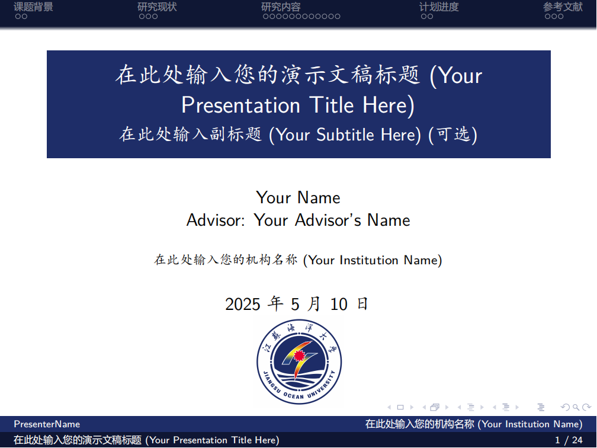

# Jiangsu Ocean University Beamer 演示文稿模板

[](https://opensource.org/licenses/MIT)
[](https://github.com/TsekaLuk/JOU-Presentation-Beamer-Template/releases/)
[](https://github.com/TsekaLuk/JOU-Presentation-Beamer-Template/stargazers)
[](https://github.com/TsekaLuk/JOU-Presentation-Beamer-Template/network/members)
[](https://github.com/TsekaLuk/JOU-Presentation-Beamer-Template/issues/)
[](https://www.overleaf.com/)
[](https://github.com/TsekaLuk/JOU-Presentation-Beamer-Template/commits)

[English](README.md) | 简体中文

本模板是专为江苏海洋大学相关学术场景设计的 Beamer 演示文稿模板，提供了整洁、专业的布局。

## 示例预览

以下是使用该模板创建的演示文稿标题页预览：



## 特性

*   基于 Beamer 文档类，结构清晰，易于管理内容。
*   通过 `ctex` 宏包提供完整的中文支持，推荐使用 XeLaTeX 编译。
*   包含常用的数学公式、图表、代码高亮等环境示例。
*   提供自定义命令和颜色定义，方便快速修改样式。
*   预留作者、标题、机构、指导教师等信息字段，方便用户填写。
*   集成了 Jiangsu Ocean University (JOU) 的校徽显示。

## 使用方法

1.  **下载模板:** 获取模板文件（`.tex` 文件、`JOU.sty` 文件、`pic` 文件夹等）。
2.  **安装 LaTeX 发行版:** 确保您的计算机上安装了完整的 LaTeX 发行版，如 TeX Live 或 MiKTeX。
3.  **安装 CTeX 宏集:** 如果您需要良好的中文支持，请确保您的 LaTeX 发行版包含 CTeX 宏集。
4.  **打开主文件:** 使用您喜欢的 LaTeX 编辑器打开 `slide.tex` 或类似的主 `.tex` 文件。
5.  **填写信息:** 修改文档开头的作者、标题、副标题、机构、指导教师姓名等信息：
    ```latex
    \newcommand{\myinstitution}{在此处输入您的机构名称}
    \newcommand{\advisorname}{在此处输入您的指导教师姓名}
    \author[您的短姓名]{您的完整姓名 \\ 指导教师：\advisorname}
    \title{在此处输入您的演示文稿标题}
    \subtitle{在此处输入副标题（可选）}
    \institute{\myinstitution}
    \date{在此处输入日期 或 \today}
    ```
6.  **添加内容:** 在 `\begin{document}` 和 `\end{document}` 环境之间添加您的演示文稿内容。使用 `\section{...}` 创建新的章节，使用 `\begin{frame}{...}\end{frame}` 创建新的幻灯片。
7.  **插入图片:** 将图片文件（推荐使用 PDF 或 PNG 格式）放入 `pic` 文件夹中，并使用 `\includegraphics` 命令插入：
    ```latex
    \begin{frame}{示例图片}
        \begin{figure}
            \centering
            \includegraphics[width=0.5\linewidth]{pic/your_image.png}
            \caption{您的图片标题}
        \end{figure}
    \end{frame}
    ```
    请注意更新 `pic/your_image.png` 为您实际的图片路径和文件名。
8.  **管理参考文献:** 模板通常使用 BibTeX 或 BibLaTeX 管理参考文献。如果使用 BibTeX，请在 `ref.bib` 文件中添加您的参考文献条目，并在需要引用的地方使用 `\cite{...}` 命令。在参考文献部分使用 `\bibliography{ref}` 和 `\bibliographystyle{...}`。
9.  **编译:** 推荐使用 **XeLaTeX** 编译器进行编译，以获得最佳的中文显示效果。通常需要编译多次（XeLaTeX -> BibTeX (如果使用) -> XeLaTeX -> XeLaTeX）来正确生成目录、交叉引用和参考文献。

## 在 Overleaf 中使用

[Overleaf](https://www.overleaf.com/) 是在线 LaTeX 编辑平台，无需本地安装。

1. **上传模板文件**：新建项目并上传所有模板文件（或打包为 ZIP 上传）。
2. **设置编译器**：在菜单中将编译器设为 **XeLaTeX**，以支持中文。
3. **文件结构**：确保 `JOU.sty`、主 `.tex` 文件、`pic` 文件夹和 `ref.bib`（如有）在正确位置。
4. **协作**：可通过"共享"功能邀请他人协作。
5. **编译与下载**：点击"重新编译"生成 PDF，编辑完成后可下载 PDF 或源文件。

如遇中文问题，确保加载 `ctex` 宏包（`\usepackage{ctex}`）。

## 模板结构

*   `slide.tex` (或主 `.tex` 文件): 演示文稿的主体文件，包含内容和布局设置。
*   `JOU.sty`: 自定义的 Beamer 样式文件，定义了模板的外观和一些特定功能。
*   `pic/`: 存放演示文稿中使用的图片文件。
*   `ref.bib`: (如果使用 BibTeX) 存放参考文献条目的 BibTeX 文件。
*   `example.tex`: 提供了相关学科竞赛国奖答辩的真实参考示例。

## 自定义

您可以修改 `JOU.sty` 文件来进一步自定义模板的外观，但这需要一定的 LaTeX Beamer 知识。简单的自定义（如修改颜色、字体大小）可以在 `.tex` 文件中通过 Beamer 提供的命令实现。

如果您需要替换校徽，请更新 `slide.tex` 中 `\includegraphics` 命令的图片路径。

## 原始来源与参考

本模板参考了网络上的 Beamer 模板资源，特别是 Overleaf 上的相关模板。
原始参考链接：`https://www.latexstudio.net/archives/4051.html`

## 贡献

如果您发现了 Bug 或有改进建议，欢迎访问 GitHub 项目地址提交 Issue 或 Pull Request：
`https://github.com/TsekaLuk/JOU-Presentation-Beamer-Template`

## 许可证

本项目基于 MIT 许可证。请查阅许可证文件获取详细信息。

---

**注意:** 本模板为 Jiangsu Ocean University 学生或教职员工进行学术交流和报告提供便利。在使用时请遵守学校的相关规定。 